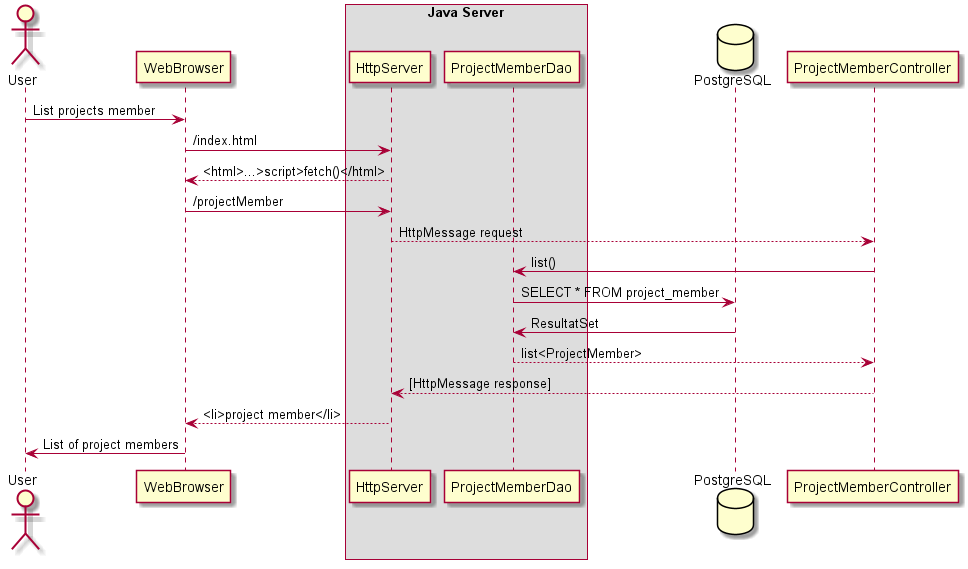

# Project Task Manager
pgr203eksamen-UnstableCodebase created by GitHub Classroom

Dette er vår Project Task manager som er en eksamensoppgave i PGR203 Avansert Java Høst 2020. 
Oppgavene er laget av: Fredrik, Andreas og Pernille. 
I Project Task Manager har du mulighet til å opprette et prosjektmedlem, en prosjektoppgave. Tildele oppgaver til et prosjektmedlem og sette status for oppgaven. Man har også mulighet til å endre status etter hvert som oppgaven er under behandling eller løst. 

# Programmet kjøres ved å:
Bygg og test Executable jar-fil 
1.	Kjør først en Maven clean
2.	Kjør Maven package for å opprette jar filen som skal kjøres
3.	Du må ha en konfigureringsfil som heter pgr203.properties, den må inneholde

- dataSource.url=
- dataSource.username=
- dataSource.password=

# Funksjonalitet:
Man kan besøke forside på localhos:8080/index.html hvor man kan velge mellom:

Add new project member
 - Her kan du legge inn et prosjektmedlem med navn, etternavn og e-postadresse

Project member list
 - Her får du listet opp prosjektmedlemmene som er opprettet

Add task
 - Her kan du opprettet en oppgave

Task list
 - Her får du listet opp oppgavene som er opprettet

Edit project task
 - Her kan du tildele en oppgave til et prosjekt medlem

List Members and assigned tasks
 - Denne viser hvilke oppgaver som er tildelt til prosjektmedlem

Edit status to task
 - Alle oppgavene er automatisk satt med en default to do og her kan du endre statusen på oppgaven

# Egenevaluering
Vi har alltid jobbet sammen over Discord og forsøkt å push koden til hverandre så ofte som mulig. Det var utfordrende, så vi valgte ofte at èn holdt på koden, mens vi alle så på og diskuterte i fellesskap.  Så pushet vi nå vi visste at vi hadde en klar plan videre eller om en sto fast. 

Vi var usikre i startet og vi visste ikke hvor vi skulle starte. Det var mye å holde kontroll på. Men for hver ting vi implementerte fikk vi litt mer forståelse for koden og hvordan alt henger sammen. Vi har lært at koden endres seg underveis mens man bygger. Og at man kan bruke lang tid på å lete etter små feil som f.eks. skrive feil, og at det er viktig med pauser.

Pause ble etterhvert spesielt viktig da vi ofte tok en time eller to pause for at en av oss kom tilbake med en løsning på et problem vi hadde støtt på. 

# Ting vi ønsket å gjøre annerledes 
Vi skulle gjerne hatt med implementasjon av cookies for det hadde vi lyst til å lære oss. Vi ønsket også å få til favicon og ha bedre testdekning. 
Samt skulle vi ønsket av vi fikk til å tildele en person flere oppgaver med dagens løsning fungerer ikke å vi forstår at vi måtte hatt en ekstra tabell for å få dette inn, men vi føler at måten vi har løst på fremdeles har vært lur. 

# Designsbeskrivelse

